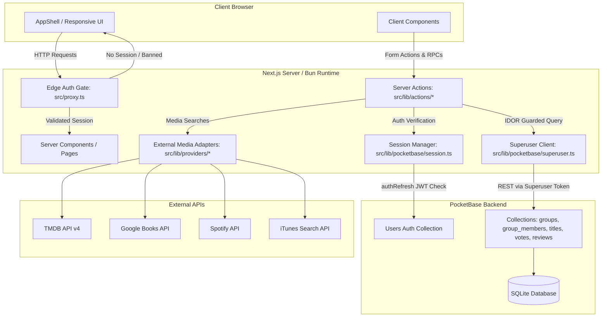

# Titirek Architecture Guide

This document outlines the core architectural patterns, execution lifecycles, and security mechanisms of the **Titirek** platform.

---

## 1. High-Level System Architecture

Titirek uses a **Next.js 15+ (React 19) App Router** frontend running on the **Bun** runtime, paired with **PocketBase** (embedded SQLite) as a decoupled headless backend and authentication engine.



---

## 2. Next.js App Router & Server Action Model

### Zero Client-Side PocketBase Access
In traditional BaaS applications, client code often imports a client SDK to query the database directly using Row-Level Security (RLS) or collection API rules. 

**Titirek eliminates client-side database access entirely:**
1. All PocketBase collections enforce `null` API rules (`listRule`, `viewRule`, `createRule`, `updateRule`, `deleteRule`).
2. Only the Next.js server executes database operations using an authenticated **Superuser Client** ([`src/lib/pocketbase/superuser.ts`](file:///home/devhax/projects/fusuycorp/titirek/src/lib/pocketbase/superuser.ts)).
3. All UI data mutations occur via Next.js Server Actions ([`src/lib/actions/*`](file:///home/devhax/projects/fusuycorp/titirek/src/lib/actions/)).

### Server Action Calling Patterns

The application distinguishes between two primary action invocation styles:

#### Pattern A: Direct `<form action={...}>` with Server-Side Redirects
Used for standard form submissions (e.g., [`voteOnTitle`](file:///home/devhax/projects/fusuycorp/titirek/src/lib/actions/votes.ts), [`markConsumed`](file:///home/devhax/projects/fusuycorp/titirek/src/lib/actions/titles.ts), [`submitReview`](file:///home/devhax/projects/fusuycorp/titirek/src/lib/actions/reviews.ts)).
- Next.js executes the action on the server.
- The action calls [`revalidatePath()`](file:///home/devhax/projects/fusuycorp/titirek/src/lib/actions/votes.ts#L58) to refresh the Server Component cache.
- Any unauthenticated state calls `redirect("/login")`, which throws Next.js's internal control exception to trigger navigation.

#### Pattern B: Imperative Client RPC with `useRouter()` Navigation
Used for dialogs, search inputs, and modal flows (e.g., [`searchTitles`](file:///home/devhax/projects/fusuycorp/titirek/src/lib/actions/titles.ts#L22), [`addTitle`](file:///home/devhax/projects/fusuycorp/titirek/src/lib/actions/titles.ts#L34), [`createGroup`](file:///home/devhax/projects/fusuycorp/titirek/src/lib/actions/groups.ts#L28), [`leaveGroup`](file:///home/devhax/projects/fusuycorp/titirek/src/lib/actions/groups.ts#L160), [`deleteAccount`](file:///home/devhax/projects/fusuycorp/titirek/src/lib/actions/profile.ts#L22)).
- When an action is called imperatively inside a client component `try/catch` block, throwing `redirect()` would cause the Promise to reject with Next's internal redirect signal and be swallowed by the client's catch block.
- Therefore, these actions return data (or error messages) directly, and the client component uses `useRouter().push(...)` upon resolution.

---

## 3. PocketBase Superuser Client Singleton

Located in [`src/lib/pocketbase/superuser.ts`](file:///home/devhax/projects/fusuycorp/titirek/src/lib/pocketbase/superuser.ts), this module manages the authoritative backend connection:

```typescript
// Shared global singleton across server-side hot reloads
const pb = globalThis.__pbSuperuser ?? createClient();
globalThis.__pbSuperuser = pb;
```

### Key Engineering Details:
1. **Disabled Auto-Cancellation**: PocketBase's JS SDK cancels pending requests by default if a new duplicate request is triggered. On a shared multi-tenant server, this would cause unrelated concurrent user requests to cancel each other. `pb.autoCancellation(false)` is explicitly set.
2. **Concurrent Auth Mutex**: If the superuser token expires or is uninitialized, [`ensureAuthenticated()`](file:///home/devhax/projects/fusuycorp/titirek/src/lib/pocketbase/superuser.ts#L24-L40) sets a shared `globalThis.__pbSuperuserAuth` promise. All concurrent requests await the single authentication attempt without issuing redundant superuser login calls.
3. **Auto-Refresh Threshold**: Configured with `{ autoRefreshThreshold: 30 * 60 }` (30 minutes) to proactively refresh the superuser token before expiration.

---

## 4. Stateless JWT + Live Server-Side Re-Verification

Authentication is managed in [`src/lib/pocketbase/session.ts`](file:///home/devhax/projects/fusuycorp/titirek/src/lib/pocketbase/session.ts):

### Session Token Flow
1. Upon successful login, the client receives an `httpOnly`, `sameSite: "lax"`, `secure: isProd` cookie named `pb_session` containing the PocketBase user JWT.
2. **On every incoming request**, [`getSessionFromToken()`](file:///home/devhax/projects/fusuycorp/titirek/src/lib/pocketbase/session.ts#L21-L43) calls:
   ```typescript
   const pb = new PocketBase(process.env.PB_URL);
   pb.authStore.save(token, null);
   const { record } = await pb.collection("users").authRefresh<UsersResponse>();
   ```

### Why Live `authRefresh()` Matters:
- Standard stateless JWTs cannot be revoked until expiry without a central denylist.
- By calling `authRefresh()` on PocketBase server-side, Titirek verifies the cryptographic signature, checks user validity, and retrieves the latest database record (`bannedAt`, `isAdmin`, `name`).
- If an admin bans a user via [`banUser()`](file:///home/devhax/projects/fusuycorp/titirek/src/lib/actions/admin.ts#L33), their session is rejected on their **very next HTTP request** without maintaining a separate Redis/memory session store.

---

## 5. Edge Proxy Routing & Auth Gate

Defined in [`src/proxy.ts`](file:///home/devhax/projects/fusuycorp/titirek/src/proxy.ts):

```typescript
export default async function proxy(req: NextRequest) {
  const session = await getSessionFromToken(
    req.cookies.get(SESSION_COOKIE_NAME)?.value,
  );

  if (!session) {
    return NextResponse.redirect(new URL("/login", req.nextUrl));
  }
  if (req.nextUrl.pathname.startsWith("/admin") && !session.isAdmin) {
    return NextResponse.redirect(new URL("/groups", req.nextUrl));
  }
}
```

### Segment-Bounded Matcher Regex
```typescript
matcher: [
  "/((?!(?:api/auth|login|reset-password|privacy|terms|_next/static|_next/image|favicon\\.ico)(?:/|$)).*)",
]
```
The matcher uses explicit segment boundaries `(?:/|$)` so public prefixes (e.g. `/terms`) do not accidentally expose similarly-prefixed private routes (e.g. `/terms-admin`).

---

## 6. Concurrency-Resilient Voting Architecture

In a group voting system, multiple members (or a single member double-clicking) can trigger concurrent vote changes on the same title.

### Deterministic Record Hashing
PocketBase record IDs are capped at 15 lowercase alphanumeric characters. Rather than generating random IDs, Titirek derives a deterministic 15-character base36 hash of `titleId:userId` in [`src/lib/pocketbase/vote-id.ts`](file:///home/devhax/projects/fusuycorp/titirek/src/lib/pocketbase/vote-id.ts):

```typescript
export async function voteRecordId(titleId: string, userId: string): Promise<string> {
  const digest = await crypto.subtle.digest(
    "SHA-256",
    new TextEncoder().encode(`${titleId}:${userId}`),
  );
  // Extract 80 bits and convert to 15 base36 characters
  ...
}
```

### Atomic Toggle & Flip Logic in `voteOnTitle`:
1. `pb.collection("votes").create({ id, title: titleId, user: userId, value })` is executed.
2. Under SQLite's single-writer architecture, concurrent creates serialize. Exactly one succeeds; the second collides on the deterministic `id` (or unique index) and throws a 400 validation error.
3. The catch block in [`src/lib/actions/votes.ts`](file:///home/devhax/projects/fusuycorp/titirek/src/lib/actions/votes.ts#L39-L56) intercepts the 400 error:
   - Fetches the existing vote by `id`.
   - If `existing.value === value` $\to$ **Delete** (toggle off vote).
   - If `existing.value !== value` $\to$ **Update** (flip vote from up to down or vice versa).
4. Catches `isNotFound` errors to safely ignore race conditions if another request deleted the vote concurrently.

---

## 7. Multi-Tenant IDOR Defense in Depth

To prevent **Insecure Direct Object References (IDOR)** across private circles:

```
[Request]
   │
   ▼
1. getSession()                       --> Validates active user JWT & bannedAt
   │
   ▼
2. requireMembership(groupId, userId) --> Confirms user is member of circle
   │
   ▼
3. requireTitleInGroup(titleId, grp)  --> Confirms title actually belongs to circle
   │
   ▼
4. requireOwner(groupId, userId)      --> (Optional) Confirms caller is circle owner
   │
   ▼
[Execute Mutation]
```

Helpers are centralized in [`src/lib/membership.ts`](file:///home/devhax/projects/fusuycorp/titirek/src/lib/membership.ts) and [`src/lib/admin.ts`](file:///home/devhax/projects/fusuycorp/titirek/src/lib/admin.ts).

---

## 8. Responsive Design & Layout Hierarchy

- **Desktop (`≥768px`)**: Renders [`DesktopSidebar`](file:///home/devhax/projects/fusuycorp/titirek/src/components/layout/desktop-sidebar.tsx) containing circle shortcuts, activity links, admin access (for admins), user card, and dark/light theme switch. Group details render in a 3-column split view (2 columns for media backlogs, 1 column for circle info and member rosters).
- **Mobile (`<768px`)**: Renders a compact top bar and a fixed bottom navigation bar ([`BottomNav`](file:///home/devhax/projects/fusuycorp/titirek/src/components/bottom-nav.tsx)) with minimum 44px touch targets and safe-area inset padding.
- **Media Presentation**: Handled by [`MediaCover`](file:///home/devhax/projects/fusuycorp/titirek/src/components/media-cover.tsx) with a strict `aspect-[2/3]` container to prevent Cumulative Layout Shift (CLS) across third-party image domains.
