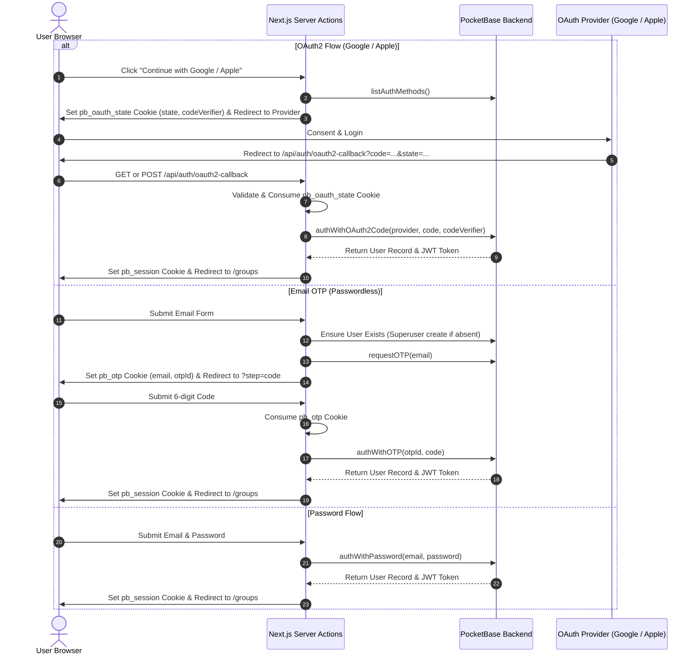

# Titirek Authentication & Security Guide

This document details the authentication architectures, session lifecycles, authorization gates, and multi-tenant security mechanisms implemented across **Titirek**.

---

## 1. Authentication Flows

Titirek supports multiple authentication methods, all orchestrated through PocketBase server-side APIs without exposing client SDK endpoints.



---

## 2. Authentication Implementations

### 2.1 OAuth2 (Google & Apple)
- **Initiation** ([`src/lib/actions/auth.ts`](file:///home/devhax/projects/fusuycorp/titirek/src/lib/actions/auth.ts#L17-L41)):
  - Calls `pb.collection("users").listAuthMethods()`.
  - Saves `{ provider, state, codeVerifier }` into the transient `pb_oauth_state` cookie (TTL: 10 minutes).
  - Redirects the user to the provider's consent screen.
- **Callback Handling** ([`src/app/api/auth/oauth2-callback/route.ts`](file:///home/devhax/projects/fusuycorp/titirek/src/app/api/auth/oauth2-callback/route.ts)):
  - Supports both **GET** (Google query parameters) and **POST** (Apple `form_post` response mode).
  - Consumes and deletes the `pb_oauth_state` cookie.
  - Exchanges the code using `authWithOAuth2Code(provider, code, codeVerifier, redirectUrl)`.
  - Checks `record.bannedAt` before issuing the session cookie.

### 2.2 Passwordless Email OTP
- **Request Step** ([`src/lib/actions/auth.ts`](file:///home/devhax/projects/fusuycorp/titirek/src/lib/actions/auth.ts#L43-L74)):
  - Standard PocketBase `requestOTP()` is a silent no-op for unknown emails (anti-enumeration).
  - To support "first email sign-in creates the account", the superuser client checks if the user exists and creates a placeholder user if absent.
  - Calls `requestOTP(email)` and stores `{ email, otpId }` in the transient `pb_otp` cookie (TTL: 5 minutes).
- **Verification Step** ([`src/lib/actions/auth.ts`](file:///home/devhax/projects/fusuycorp/titirek/src/lib/actions/auth.ts#L76-L101)):
  - Consumes the `pb_otp` cookie.
  - Invokes `pb.collection("users").authWithOTP(otpId, code)`.
  - On success, checks `record.bannedAt` and sets the `pb_session` cookie.

### 2.3 Password Sign-In & Sign-Up
- **Sign-In** ([`src/lib/actions/auth.ts`](file:///home/devhax/projects/fusuycorp/titirek/src/lib/actions/auth.ts#L103-L125)):
  - Executes `authWithPassword(email, password)`.
  - Checks `record.bannedAt` and sets the `pb_session` cookie.
- **Sign-Up** ([`src/lib/actions/auth.ts`](file:///home/devhax/projects/fusuycorp/titirek/src/lib/actions/auth.ts#L127-L164)):
  - Validates password length ($8 \le \text{length} \le 128$).
  - Since the `users` collection has `null` create rules, self-service creation is executed via the **Superuser Client**.
  - Catches `isValidationNotUnique(err, "email")` to redirect with `?error=EmailInUse`.
  - Authenticates immediately upon creation and sets the `pb_session` cookie.

### 2.4 Password Reset
- **Request Link** ([`src/lib/actions/auth.ts`](file:///home/devhax/projects/fusuycorp/titirek/src/lib/actions/auth.ts#L166-L181)):
  - Calls `requestPasswordReset(email)` with errors swallowed to prevent account enumeration.
- **Confirm Token** ([`src/lib/actions/auth.ts`](file:///home/devhax/projects/fusuycorp/titirek/src/lib/actions/auth.ts#L183-L205)):
  - Confirms token and passwords match before calling `pb.collection("users").confirmPasswordReset(token, password, passwordConfirm)`.

---

## 3. Cookie Management & Security Parameters

All cookies are issued from [`src/lib/pocketbase/session.ts`](file:///home/devhax/projects/fusuycorp/titirek/src/lib/pocketbase/session.ts) with strict security configurations:

| Cookie Name | Purpose | Scope | Max-Age | Security Flags |
|---|---|---|---|---|
| `pb_session` | Authenticated PocketBase User JWT | Entire site (`/`) | 5 days (`432000s`) | `httpOnly: true`, `sameSite: "lax"`, `secure: isProd` |
| `pb_oauth_state` | PKCE `codeVerifier` & CSRF `state` | Entire site (`/`) | 10 minutes (`600s`) | `httpOnly: true`, `sameSite: "lax"`, `secure: isProd` |
| `pb_otp` | Active OTP transaction (`otpId`, `email`) | Entire site (`/`) | 5 minutes (`300s`) | `httpOnly: true`, `sameSite: "lax"`, `secure: isProd` |

---

## 4. Multi-Tenant IDOR Defense in Depth

In a multi-group application, preventing **Insecure Direct Object References (IDOR)** is paramount. Server Actions are directly addressable HTTP endpoints; an attacker could invoke actions with legitimate credentials but target arbitrary `groupId` or `titleId` values.

Titirek enforces a strict four-tier verification chain before executing any mutation:

```
[Incoming Server Action Call]
       │
       ▼
1. getSession()
   └── Validates token signature & verifies bannedAt is null.
       │
       ▼
2. requireMembership(groupId, userId)
   └── Validates caller is an active member of target circle.
       │
       ▼
3. requireTitleInGroup(titleId, groupId)
   └── Confirms target titleId actually belongs to groupId.
       │
       ▼
4. requireOwner(groupId, userId) [Optional]
   └── Confirms caller is the owner of target circle.
       │
       ▼
[Execute Mutation with Superuser Client]
```

### Implementation Details:
- [`requireMembership(groupId, userId)`](file:///home/devhax/projects/fusuycorp/titirek/src/lib/membership.ts#L8-L26): Queries `group_members` for `group = groupId && user = userId`.
- [`requireTitleInGroup(titleId, groupId)`](file:///home/devhax/projects/fusuycorp/titirek/src/lib/membership.ts#L45-L63): Crucial defense preventing a member of Group A from mutating a title that belongs to Group B.
- [`requireOwner(groupId, userId)`](file:///home/devhax/projects/fusuycorp/titirek/src/lib/membership.ts#L28-L37): Verifies `membership.role === 'owner'`.
- [`requireAdmin(userId)`](file:///home/devhax/projects/fusuycorp/titirek/src/lib/admin.ts#L4-L9): Verifies `user.isAdmin === true`.

---

## 5. Instant Account Ban Enforcement

Traditional stateless JWT implementations suffer from revocation delays until token expiration.

### How Titirek Achieves Instant Revocation:
1. When an admin calls [`banUser(userId)`](file:///home/devhax/projects/fusuycorp/titirek/src/lib/actions/admin.ts#L33), PocketBase sets `bannedAt = new Date().toISOString()`.
2. On every incoming request to Next.js, [`getSessionFromToken()`](file:///home/devhax/projects/fusuycorp/titirek/src/lib/pocketbase/session.ts#L21-L43) calls `authRefresh()` against PocketBase.
3. If `record.bannedAt` is present, `getSessionFromToken` returns `null`.
4. [`src/proxy.ts`](file:///home/devhax/projects/fusuycorp/titirek/src/proxy.ts) immediately intercepts the request and redirects the user to `/login`.

---

## 6. Input Bounds & Sanitization

To protect against unbounded payloads and injection:
- **Title strings**: Trimmed and capped to **300 characters** ([`src/lib/actions/titles.ts`](file:///home/devhax/projects/fusuycorp/titirek/src/lib/actions/titles.ts#L50)).
- **User display names**: Trimmed and capped to **200 characters** ([`src/lib/actions/profile.ts`](file:///home/devhax/projects/fusuycorp/titirek/src/lib/actions/profile.ts#L13)).
- **Passwords**: Enforced between **8 and 128 characters** ([`src/lib/actions/auth.ts`](file:///home/devhax/projects/fusuycorp/titirek/src/lib/actions/auth.ts#L133-L134)).
- **Review text**: Trimmed and capped to **5,000 characters** ([`src/lib/actions/reviews.ts`](file:///home/devhax/projects/fusuycorp/titirek/src/lib/actions/reviews.ts#L26)).
- **Image URLs**: Validated against protocol whitelist `/^https?:\/\//i` ([`src/lib/actions/titles.ts`](file:///home/devhax/projects/fusuycorp/titirek/src/lib/actions/titles.ts#L57)).
- **External Provider Requests**: Bounded with `AbortSignal.timeout(8000)` to prevent server hanging.
