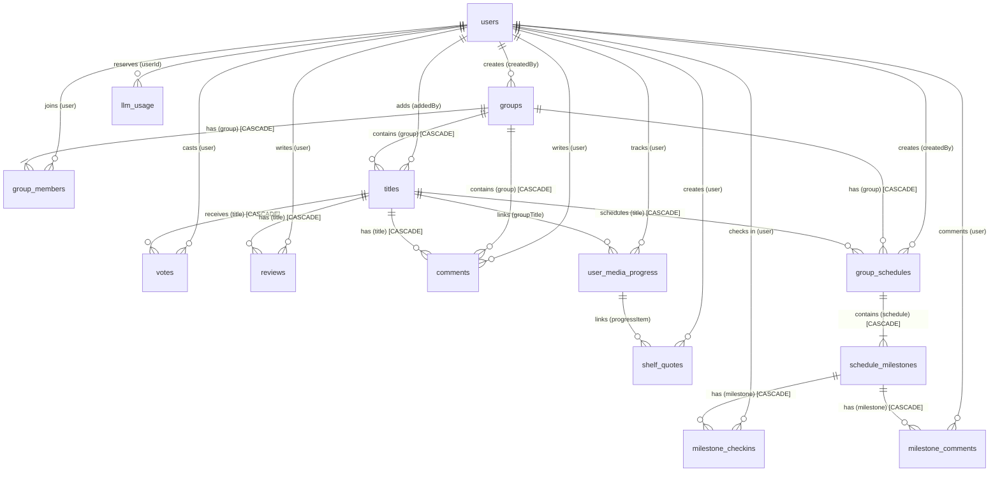

# HepYeni Data Models & Database Schema

This document details the database architecture, PocketBase schema collections, relational cascading rules, indexes, and TypeScript types for **HepYeni**.

---

## 1. Entity-Relationship Diagram (ERD)



---

## 2. PocketBase Collections Specification

All collections enforce `null` API rules (`listRule: null`, `viewRule: null`, `createRule: null`, `updateRule: null`, `deleteRule: null`), preventing direct client-side SDK interactions. Access is mediated exclusively through superuser server-side actions with strict multi-tenant authorization guards.

### 2.1 Collection: `users` (Auth)
The built-in auth collection extended with application-specific metadata.

| Field Name | Type | Options / Validation | Purpose |
|---|---|---|---|
| `id` | Record ID | 15 alphanumeric characters | Primary Key |
| `email` | Email | Unique, System field | User login email |
| `name` | Text | Max: 200 chars | Display name |
| `avatarUrl` | Text | Max: 2000 chars | User avatar image URL |
| `isAdmin` | Bool | Default: `false` | Platform administration access |
| `bannedAt` | Date | Nullable | If set, immediately invalidates all active sessions |
| `verified` | Bool | System field | Email verification status |
| `passwordAuth` | Auth Option | Enabled: `true` | Password login support |
| `otp` | Auth Option | Enabled: `true` | Passwordless Email OTP support |
| `oauth2` | Auth Option | Google, Apple | Social OAuth2 support |

### 2.2 Collection: `groups` (Base)
Represents private media circles.

| Field Name | Type | Options / Validation | Purpose |
|---|---|---|---|
| `id` | Record ID | 15 alphanumeric characters | Primary Key |
| `name` | Text | Required, Max: 200 chars | Circle display name |
| `inviteCode` | Text | Required, Max: 20 chars | Unique 8-char invite code |
| `createdBy` | Relation | `users.id`, `cascadeDelete: false` | User who created the circle |
| `isPublic` | Bool | Default: `false` | Public discoverability flag |
| `isBlindPickEnabled` | Bool | Default: `false` | Redacts proposal author identities during voting |
| `guestSettings` | JSON | Optional JSON configuration | Fine-grained public invite guest permissions |
| `createdAt` | Autodate | `onCreate: true` | Creation timestamp |

- **Indexes**:
  - `idx_groups_invite_code` (Unique): `inviteCode`

### 2.3 Collection: `group_members` (Base)
Represents circle membership and permissions.

| Field Name | Type | Options / Validation | Purpose |
|---|---|---|---|
| `id` | Record ID | 15 alphanumeric characters | Primary Key |
| `group` | Relation | `groups.id`, `cascadeDelete: true` | Target circle |
| `user` | Relation | `users.id`, `cascadeDelete: true` | Target member |
| `role` | Select | Values: `["owner", "member"]` | Role within circle |
| `joinedAt` | Autodate | `onCreate: true` | Join timestamp |

- **Indexes**:
  - `idx_group_members_unique` (Unique composite): `group, user`

### 2.4 Collection: `titles` (Base)
Represents media proposed, in progress, or consumed within a circle.

| Field Name | Type | Options / Validation | Purpose |
|---|---|---|---|
| `id` | Record ID | 15 alphanumeric characters | Primary Key |
| `group` | Relation | `groups.id`, `cascadeDelete: true` | Circle reference |
| `mediaType` | Select | Values: `["book", "movie", "tv", "music", "podcast"]` | Media classification |
| `externalSource` | Text | Required, Max: 100 chars | Provider identifier (`tmdb`, `google-books`, `spotify`, `itunes`, `custom`) |
| `externalId` | Text | Required, Max: 200 chars | Upstream ID from provider |
| `title` | Text | Required, Max: 300 chars | Title name |
| `creator` | Text | Optional, Max: 300 chars | Author / Director / Artist |
| `coverUrl` | Text | Optional, Max: 2000 chars | Cover artwork URL |
| `metadata` | JSON | Optional JSON payload | Release date, overview, page count, etc. |
| `status` | Select | Values: `["proposed", "consumed"]` | Stored title status in PocketBase (`proposed` or `consumed`). The communal "In Progress" section in the circle UI is derived relationally from `user_media_progress` where members have active reading/watching sessions. |
| `moods` | JSON | Array of strings | Folksonomy mood tags |
| `pace` | Text | Optional | Pacing tag (`slow_burn`, `gentle`, `fast_paced`) |
| `addedBy` | Relation | `users.id`, `cascadeDelete: false` | Member who added the item |
| `createdAt` | Autodate | `onCreate: true` | Creation timestamp |
| `startedAt` | Date | Optional ISO date | Date marked in-progress |
| `consumedAt` | Date | Optional ISO date | Date marked consumed |

- **Indexes**:
  - `idx_titles_group_external` (Unique composite): `group, externalSource, externalId`

### 2.5 Collection: `votes` (Base)
Represents member up/down votes on proposed titles.

| Field Name | Type | Options / Validation | Purpose |
|---|---|---|---|
| `id` | Record ID | 15 alphanumeric characters | **Deterministic SHA-256 base36 hash** of `title:user` |
| `title` | Relation | `titles.id`, `cascadeDelete: true` | Target title |
| `user` | Relation | `users.id`, `cascadeDelete: true` | Voting user |
| `value` | Select | Values: `["up", "down"]` | Vote direction |
| `createdAt` | Autodate | `onCreate: true` | Vote timestamp |

- **Indexes**:
  - `idx_votes_unique` (Unique composite): `title, user`

### 2.6 Collection: `reviews` (Base)
Represents 1–5 star ratings and reviews on consumed titles.

| Field Name | Type | Options / Validation | Purpose |
|---|---|---|---|
| `id` | Record ID | 15 alphanumeric characters | Primary Key |
| `title` | Relation | `titles.id`, `cascadeDelete: true` | Target title |
| `user` | Relation | `users.id`, `cascadeDelete: true` | Author user |
| `rating` | Number | Integer, Min: 1, Max: 5 | Star score |
| `reviewText` | Text | Optional, Max: 5000 chars | Review body comment |
| `createdAt` | Autodate | `onCreate: true` | Review timestamp |

- **Indexes**:
  - `idx_reviews_unique` (Unique composite): `title, user`

### 2.7 Collection: `comments` (Base)
Nested (+1 depth) discussions on circle title detail pages.

| Field Name | Type | Options / Validation | Purpose |
|---|---|---|---|
| `id` | Record ID | 15 alphanumeric characters | Primary Key |
| `title` | Relation | `titles.id`, `cascadeDelete: true` | Target title |
| `group` | Relation | `groups.id`, `cascadeDelete: true` | Parent circle |
| `user` | Relation | `users.id`, `cascadeDelete: true` | Author user |
| `content` | Text | Required, Max: 2000 chars | Comment body text |
| `parentId` | Relation | `comments.id`, Optional | Root comment reference (+1 depth max) |
| `createdAt` | Autodate | `onCreate: true` | Creation timestamp |

### 2.8 Collection: `user_media_progress` (Base)
Personal media consumption tracking on `/shelf` and communal circle progress synchronization.

| Field Name | Type | Options / Validation | Purpose |
|---|---|---|---|
| `id` | Record ID | 15 alphanumeric characters | Primary Key |
| `user` | Relation | `users.id`, `cascadeDelete: true` | Shelf owner |
| `groupTitle` | Relation | `titles.id`, Optional, `cascadeDelete: false` | Linked circle proposal (relation cascade is handled by PocketBase or application logic to preserve personal shelf history) |
| `mediaType` | Select | `["book", "movie", "tv", "music", "podcast"]` | Media type |
| `title` | Text | Required, Max: 300 chars | Media title |
| `creator` | Text | Optional, Max: 300 chars | Creator/author |
| `coverUrl` | Text | Optional, Max: 2000 chars | Cover artwork URL |
| `status` | Select | `["want_to_consume", "in_progress", "completed", "dropped"]` | Shelf consumption state |
| `progressCurrent` | Number | Integer, Min: 0 | Current page / episode / percent |
| `progressTotal` | Number | Integer, Optional | Total pages / episodes / duration |
| `progressUnit` | Select | `["pages", "percentage", "minutes", "episodes"]` | Progress measurement unit |
| `currentLabel` | Text | Optional, Max: 100 chars | e.g. "Chapter 4", "Season 2" |
| `notes` | Text | Optional, Max: 5000 chars | Private user notes |
| `rating` | Number | Optional, Integer 1–5 | Personal shelf rating |
| `isSharedWithCircles`| Bool | Default: `true` | Commits progress to circle feeds |
| `moods` | JSON | Array of strings | Folksonomy mood tags |
| `pace` | Text | Optional | Pacing tag |
| `externalSource` | Text | Optional, Max: 100 chars | Upstream provider |
| `externalId` | Text | Optional, Max: 200 chars | Upstream identifier |
| `startedAt` | Date | Optional ISO date | Reading started timestamp |
| `completedAt` | Date | Optional ISO date | Finished timestamp |
| `createdAt` | Autodate | `onCreate: true` | Creation timestamp |
| `updatedAt` | Autodate | `onUpdate: true` | Last update timestamp |

### 2.9 Collection: `group_schedules` (Base)
Communal pacing schedules tied to a circle title.

| Field Name | Type | Options / Validation | Purpose |
|---|---|---|---|
| `id` | Record ID | 15 alphanumeric characters | Primary Key |
| `group` | Relation | `groups.id`, `cascadeDelete: true` | Circle reference |
| `title` | Relation | `titles.id`, `cascadeDelete: true` | Circle title |
| `createdBy` | Relation | `users.id`, `cascadeDelete: false` | Schedule creator |
| `name` | Text | Required, Max: 200 chars | Schedule label |
| `startDate` | Date | Required ISO date | Pacing start date |
| `endDate` | Date | Required ISO date | Target completion date |
| `createdAt` | Autodate | `onCreate: true` | Creation timestamp |

### 2.10 Collection: `schedule_milestones` (Base)
Individual check-in checkpoints within a communal schedule.

| Field Name | Type | Options / Validation | Purpose |
|---|---|---|---|
| `id` | Record ID | 15 alphanumeric characters | Primary Key |
| `schedule` | Relation | `group_schedules.id`, `cascadeDelete: true` | Parent schedule |
| `title` | Text | Required, Max: 200 chars | Milestone name (e.g. "Chapters 1-5") |
| `orderIndex` | Number | Integer, Min: 0 | Sequential order |
| `targetDate` | Date | Optional ISO date | Target completion date |
| `description` | Text | Optional, Max: 1000 chars | Milestone instructions |
| `createdAt` | Autodate | `onCreate: true` | Creation timestamp |

### 2.11 Collection: `milestone_checkins` (Base)
Member completion check-ins for a schedule milestone.

| Field Name | Type | Options / Validation | Purpose |
|---|---|---|---|
| `id` | Record ID | 15 alphanumeric characters | Primary Key |
| `milestone` | Relation | `schedule_milestones.id`, `cascadeDelete: true` | Target milestone |
| `user` | Relation | `users.id`, `cascadeDelete: true` | Checked-in member |
| `checkedInAt` | Autodate | `onCreate: true` | Check-in timestamp |

- **Indexes**:
  - `idx_milestone_checkin_unique` (Unique composite): `milestone, user`

### 2.12 Collection: `milestone_comments` (Base)
Milestone campfire discussions with server-side spoiler redaction for non-checked-in members.

| Field Name | Type | Options / Validation | Purpose |
|---|---|---|---|
| `id` | Record ID | 15 alphanumeric characters | Primary Key |
| `milestone` | Relation | `schedule_milestones.id`, `cascadeDelete: true` | Target milestone |
| `user` | Relation | `users.id`, `cascadeDelete: true` | Author member |
| `content` | Text | Required, Max: 2000 chars | Discussion body text |
| `createdAt` | Autodate | `onCreate: true` | Creation timestamp |

### 2.13 Collection: `shelf_quotes` (Base)
Digital marginalia and passage excerpts clipped to shelf or shared with specific circles.

| Field Name | Type | Options / Validation | Purpose |
|---|---|---|---|
| `id` | Record ID | 15 alphanumeric characters | Primary Key |
| `user` | Relation | `users.id`, `cascadeDelete: true` | Quote author |
| `progressItem` | Relation | `user_media_progress.id`, Optional, `cascadeDelete: null` | Linked shelf item |
| `titleName` | Text | Required, Max: 200 chars | Media title |
| `quoteText` | Text | Required, Max: 3000 chars | Clipped quotation |
| `attribution` | Text | Optional, Max: 200 chars | Author / chapter / timestamp |
| `mediaType` | Text | Optional | Media type tag |
| `tags` | JSON | Array of strings | Categorization tags |
| `isSharedWithCircles`| JSON | Array of circle ID strings | Multi-scope circle sharing list |
| `createdAt` | Autodate | `onCreate: true` | Creation timestamp |

### 2.14 Collection: `llm_usage` (Base)
Durable atomic rate-limiting reservations for AI text extraction quotas across server instances.

| Field Name | Type | Options / Validation | Purpose |
|---|---|---|---|
| `id` | Record ID | 15 alphanumeric characters | Unique reservation identifier |
| `userId` | Text | Required | User identifier |
| `inputChars` | Number | Integer, Min: 0 | Character cost of extraction turn |
| `createdAt` | Autodate | `onCreate: true` | Reservation timestamp |

---

## 3. Cascading Deletion & Referential Integrity

PocketBase manages referential integrity through native `cascadeDelete` settings:

1. **Circle Deletion (`groups.delete(id)`)**:
   - `group_members.group` (`cascadeDelete: true`) $\to$ Deletes all member associations.
   - `titles.group` (`cascadeDelete: true`) $\to$ Deletes all titles in the circle.
   - `comments.group` (`cascadeDelete: true`) $\to$ Deletes all title comments.
   - `group_schedules.group` (`cascadeDelete: true`) $\to$ Deletes all schedules, milestones, check-ins, and campfire comments.
   - `votes.title` and `reviews.title` (`cascadeDelete: true`) $\to$ Automatically deleted when their parent title is removed.
2. **Circle Title Deletion (`titles.delete(id)`)**:
   - `votes.title` and `reviews.title` (`cascadeDelete: true`) $\to$ Automatically deleted when their parent title is removed.
   - `comments.title` (`cascadeDelete: true`) $\to$ Automatically deleted.
   - `group_schedules.title` (`cascadeDelete: true`) $\to$ Automatically deleted.
   - `user_media_progress.groupTitle` (`cascadeDelete: false`) $\to$ Relation cascade is handled by PocketBase or application logic: user shelf entries are preserved rather than deleted, safely unlinking the relation so user consumption records remain intact.
3. **User Account Deletion (`users.delete(id)`)**:
   - `group_members.user`, `votes.user`, `reviews.user`, `comments.user`, `user_media_progress.user`, `milestone_checkins.user`, `milestone_comments.user`, `shelf_quotes.user` have `cascadeDelete: true`.
   - **Protection Rule**: `groups.createdBy` and `titles.addedBy` specify `cascadeDelete: false`. If a user attempts to delete their account while still owning a circle or active titles, PocketBase returns a `400 ClientResponseError`, requiring them to transfer ownership or remove groups first.
4. **Relational Progress Lifecycle (ADR-015)**:
   - In PocketBase, `titles.status` stores strictly `proposed` or `consumed`.
   - The communal "In Progress" section in the circle UI is derived relationally from `user_media_progress` where members have active reading/watching sessions.
   - The helper `categorizeCircleTitles` partitions circle titles into a 3-section lifecycle:
     - **Up Next (Proposed)**: `status === "proposed"` and no active member reading sessions.
     - **In Progress**: At least one active circle member has an active reading/watching session in `user_media_progress`.
     - **Finished (Consumed)**: `status === "consumed"` or all circle members have completed the title.

---

## 4. TypeScript Definitions & Type Generation

Generated TypeScript types are stored in `src/types/pocketbase-types.ts`.

### Regenerating Schema Types
Whenever migrations in `pb_migrations/` are updated, regenerate types using `pocketbase-typegen`:

```bash
bunx pocketbase-typegen \
  --url $PB_URL \
  --email $PB_SUPERUSER_EMAIL \
  --password $PB_SUPERUSER_PASSWORD \
  --out src/types/pocketbase-types.ts
```

> [!NOTE]
> `TitlesRecord` and `TitlesResponse` in `src/types/pocketbase-types.ts` simplify the generic metadata parameter to `Record<string, unknown> | null` for unified usage with the single `Texpand` generic parameter across the codebase.
