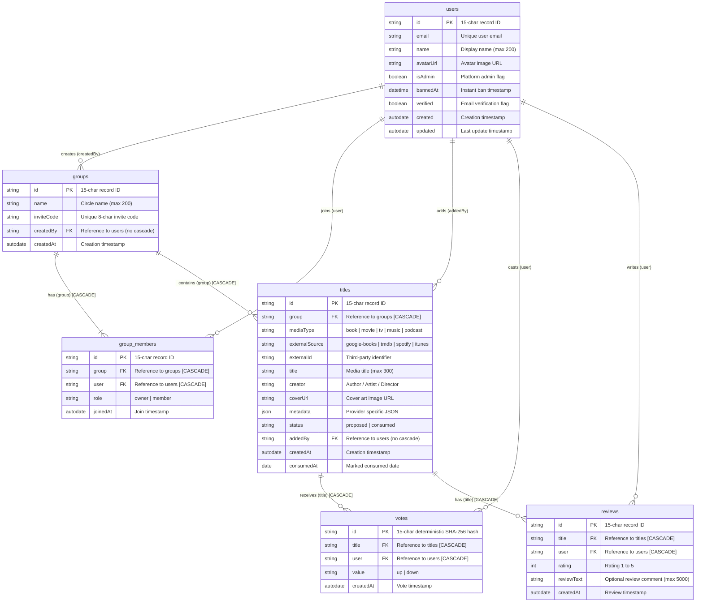

# Titirek Data Models & Database Schema

This document details the database architecture, PocketBase schema collections, relational cascading rules, indexes, and TypeScript types for **Titirek**.

---

## 1. Entity-Relationship Diagram (ERD)



---

## 2. PocketBase Collections Specification

All collections enforce `null` API rules (`listRule: null`, `viewRule: null`, `createRule: null`, `updateRule: null`, `deleteRule: null`), preventing direct client-side SDK interactions.

### 2.1 Collection: `users` (Auth)
The built-in auth collection extended with application-specific metadata.

| Field Name | Type | Options / Validation | Purpose |
|---|---|---|---|
| `id` | Record ID | 15 alphanumeric characters | Primary Key |
| `email` | Email | Unique, System field | User login email |
| `name` | Text | Max: 200 chars | Display name |
| `avatarUrl` | Text | Max: 2000 chars | User avatar image URL |
| `isAdmin` | Bool | Default: `false` | Platform administration access |
| `bannedAt` | Date | Nullable | If set, immediately invalidates all active sessions |
| `verified` | Bool | System field | Email verification status |
| `passwordAuth` | Auth Option | Enabled: `true` | Password login support |
| `otp` | Auth Option | Enabled: `true` | Passwordless Email OTP support |
| `oauth2` | Auth Option | Google, Apple | Social OAuth2 support |

### 2.2 Collection: `groups` (Base)
Represents private media circles.

| Field Name | Type | Options / Validation | Purpose |
|---|---|---|---|
| `id` | Record ID | 15 alphanumeric characters | Primary Key |
| `name` | Text | Required, Max: 200 chars | Circle display name |
| `inviteCode` | Text | Required, Max: 20 chars | Unique 8-char invite code |
| `createdBy` | Relation | `users.id`, `cascadeDelete: false` | User who created the circle |
| `createdAt` | Autodate | `onCreate: true` | Creation timestamp |

- **Indexes**:
  - `idx_groups_invite_code` (Unique): `inviteCode`

### 2.3 Collection: `group_members` (Base)
Represents circle membership and permissions.

| Field Name | Type | Options / Validation | Purpose |
|---|---|---|---|
| `id` | Record ID | 15 alphanumeric characters | Primary Key |
| `group` | Relation | `groups.id`, `cascadeDelete: true` | Target circle |
| `user` | Relation | `users.id`, `cascadeDelete: true` | Target member |
| `role` | Select | Values: `["owner", "member"]` | Role within circle |
| `joinedAt` | Autodate | `onCreate: true` | Join timestamp |

- **Indexes**:
  - `idx_group_members_unique` (Unique composite): `group, user`

### 2.4 Collection: `titles` (Base)
Represents proposed or consumed media within a circle.

| Field Name | Type | Options / Validation | Purpose |
|---|---|---|---|
| `id` | Record ID | 15 alphanumeric characters | Primary Key |
| `group` | Relation | `groups.id`, `cascadeDelete: true` | Circle reference |
| `mediaType` | Select | Values: `["book", "movie", "tv", "music", "podcast"]` | Media classification |
| `externalSource` | Text | Required, Max: 100 chars | Provider identifier (`tmdb`, `google-books`, etc.) |
| `externalId` | Text | Required, Max: 200 chars | Upstream ID from provider |
| `title` | Text | Required, Max: 300 chars | Title name |
| `creator` | Text | Optional, Max: 300 chars | Author / Director / Artist |
| `coverUrl` | Text | Optional, Max: 2000 chars | Cover artwork URL |
| `metadata` | JSON | Optional JSON payload | Release date, overview, page count, etc. |
| `status` | Select | Values: `["proposed", "consumed"]` | Backlog status |
| `addedBy` | Relation | `users.id`, `cascadeDelete: false` | Member who added the item |
| `createdAt` | Autodate | `onCreate: true` | Creation timestamp |
| `consumedAt` | Date | Optional ISO date | Date marked as consumed |

- **Indexes**:
  - `idx_titles_group_external` (Unique composite): `group, externalSource, externalId`

### 2.5 Collection: `votes` (Base)
Represents member up/down votes on proposed titles.

| Field Name | Type | Options / Validation | Purpose |
|---|---|---|---|
| `id` | Record ID | 15 alphanumeric characters | **Deterministic SHA-256 base36 hash** of `title:user` |
| `title` | Relation | `titles.id`, `cascadeDelete: true` | Target title |
| `user` | Relation | `users.id`, `cascadeDelete: true` | Voting user |
| `value` | Select | Values: `["up", "down"]` | Vote direction |
| `createdAt` | Autodate | `onCreate: true` | Vote timestamp |

- **Indexes**:
  - `idx_votes_unique` (Unique composite): `title, user`

### 2.6 Collection: `reviews` (Base)
Represents 1–5 star ratings and reviews on consumed titles.

| Field Name | Type | Options / Validation | Purpose |
|---|---|---|---|
| `id` | Record ID | 15 alphanumeric characters | Primary Key |
| `title` | Relation | `titles.id`, `cascadeDelete: true` | Target title |
| `user` | Relation | `users.id`, `cascadeDelete: true` | Author user |
| `rating` | Number | Integer, Min: 1, Max: 5 | Star score |
| `reviewText` | Text | Optional, Max: 5000 chars | Review body comment |
| `createdAt` | Autodate | `onCreate: true` | Review timestamp |

- **Indexes**:
  - `idx_reviews_unique` (Unique composite): `title, user`

---

## 3. Cascading Deletion & Referential Integrity

PocketBase manages referential integrity through native `cascadeDelete` settings:

1. **Circle Deletion (`groups.delete(id)`)**:
   - `group_members.group` (`cascadeDelete: true`) $\to$ Deletes all member associations.
   - `titles.group` (`cascadeDelete: true`) $\to$ Deletes all titles in the circle.
   - `votes.title` and `reviews.title` (`cascadeDelete: true`) $\to$ Automatically deleted when their parent title is removed.
2. **User Account Deletion (`users.delete(id)`)**:
   - `group_members.user`, `votes.user`, `reviews.user` have `cascadeDelete: true`.
   - **Protection Rule**: `groups.createdBy` and `titles.addedBy` specify `cascadeDelete: false`. If a user attempts to delete their account while still owning a circle or active titles, PocketBase returns a `400 ClientResponseError`, requiring them to transfer ownership or remove groups first ([`src/lib/actions/profile.ts`](file:///home/devhax/projects/fusuycorp/titirek/src/lib/actions/profile.ts#L22-L42)).

---

## 4. TypeScript Definitions & Type Generation

Generated TypeScript types are stored in [`src/types/pocketbase-types.ts`](file:///home/devhax/projects/fusuycorp/titirek/src/types/pocketbase-types.ts).

### Regenerating Schema Types
Whenever migrations in `pb_migrations/` are updated, regenerate types using `pocketbase-typegen`:

```bash
bunx pocketbase-typegen \
  --url $PB_URL \
  --email $PB_SUPERUSER_EMAIL \
  --password $PB_SUPERUSER_PASSWORD \
  --out src/types/pocketbase-types.ts
```

> [!NOTE]
> `TitlesRecord` and `TitlesResponse` in `src/types/pocketbase-types.ts` simplify the generic metadata parameter to `Record<string, unknown> | null` for unified usage with the single `Texpand` generic parameter across the codebase.
