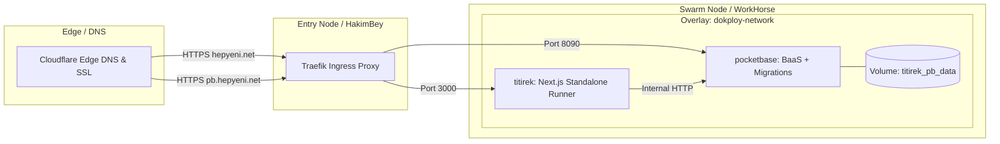

# Titirek Deployment & Infrastructure Guide

This document details the Docker containerization, Docker Swarm stack, Dokploy integration, CI/CD deployment pipelines, and environment configuration for **Titirek**.

---

## 1. Infrastructure Overview

Titirek runs as a containerized stack on **Docker Swarm** managed via **Dokploy**.



### Key Infrastructure Attributes:
- **Application URL**: `https://hepyeni.net`
- **PocketBase Admin UI**: `https://pb.hepyeni.net/_/`
- **Container Registry**: `registry.bogazici.app/budok/titirek`
- **Swarm Overlay Network**: `dokploy-network`

---

## 2. Docker Containers

### 2.1 Next.js Application: `Dockerfile`
Located in [`Dockerfile`](file:///home/devhax/projects/fusuycorp/titirek/Dockerfile), this multi-stage build creates an optimized Next.js standalone runner:

1. **`base`**: Uses `oven/bun:1-alpine` for minimal image footprint and fast runtime execution.
2. **`deps`**: Runs `bun install --frozen-lockfile`.
3. **`builder`**: Copies dependencies and runs `bun --bun next build`.
   > [!NOTE]
   > Bun 1.3.14 contains an upstream engine exit issue where the process may segfault after successfully writing `.next/standalone`. The build step gates on `bun --bun next build; test -f .next/standalone/server.js` to ensure the artifact exists before proceeding.
4. **`runner`**: Copies the standalone server, creates an unprivileged user (`nextjs:nodejs` UID/GID 1001), and starts the server via `CMD ["bun", "run", "server.js"]` on port 3000.

### 2.2 PocketBase with Baked Migrations: `Dockerfile.pocketbase`
Located in [`Dockerfile.pocketbase`](file:///home/devhax/projects/fusuycorp/titirek/Dockerfile.pocketbase):

```dockerfile
FROM ghcr.io/muchobien/pocketbase:0.39.11
COPY pb_migrations /pb_migrations
```

- **Baked Migrations**: Dokploy deploys pre-built images rather than building from git checkouts on nodes. Copying `pb_migrations/` into `/pb_migrations` ensures migrations automatically apply when the container launches.
- **Data Persistence**: Backed by the named Docker volume `titirek_pb_data:/pb_data`.
- **Admin Bootstrap**: The base image bootstraps the superuser on initial boot via `PB_ADMIN_EMAIL` and `PB_ADMIN_PASSWORD`.

---

## 3. Dokploy Swarm Stack Configuration

Production services are defined in `services/titirek/docker-stack.yml` in the selfhosted deployment repository:

```yaml
services:
  titirek:
    image: ${IMAGE_NAME:-registry.bogazici.app/budok/titirek:latest}
    networks:
      - dokploy-network
    environment:
      - NODE_ENV=production
      - PB_URL=http://pocketbase:8090
      - PB_SUPERUSER_EMAIL=${PB_SUPERUSER_EMAIL}
      - PB_SUPERUSER_PASSWORD=${PB_SUPERUSER_PASSWORD}
      - APP_URL=https://hepyeni.net
      - TMDB_API_KEY=${TMDB_API_KEY}
      - SPOTIFY_CLIENT_ID=${SPOTIFY_CLIENT_ID}
      - SPOTIFY_CLIENT_SECRET=${SPOTIFY_CLIENT_SECRET}
    deploy:
      replicas: 1
      placement:
        constraints:
          - node.hostname == WorkHorse

  pocketbase:
    image: registry.bogazici.app/budok/titirek-pb:latest
    networks:
      - dokploy-network
    volumes:
      - titirek_pb_data:/pb_data
    environment:
      - PB_ADMIN_EMAIL=${PB_SUPERUSER_EMAIL}
      - PB_ADMIN_PASSWORD=${PB_SUPERUSER_PASSWORD}
    deploy:
      replicas: 1
      placement:
        constraints:
          - node.hostname == WorkHorse

volumes:
  titirek_pb_data:
    driver: local

networks:
  dokploy-network:
    external: true
```

---

## 4. CI/CD Deployment Pipeline

The GitHub Actions workflow in [`.github/workflows/deploy.yml`](file:///home/devhax/projects/fusuycorp/titirek/.github/workflows/deploy.yml) triggers on every push to the `main` branch:

1. **Build & Push Job**:
   - Checks out the repository.
   - Sets up Docker Buildx.
   - Logs into `registry.bogazici.app` using repository secrets `REGISTRY_USERNAME` and `REGISTRY_PASSWORD`.
   - Builds and pushes `registry.bogazici.app/budok/titirek:latest`.
2. **Dokploy Redeploy Trigger**:
   - Sends an authenticated `POST /api/compose.redeploy` request to `https://dokploy.bogazici.app` with `x-api-key: ${{ secrets.DOKPLOY_API_KEY }}`.
   - Retries up to 3 times with exponential backoff to handle transient network hiccups.

---

## 5. Local Development Workflow

### 1. Download & Launch PocketBase
```bash
# Download PocketBase (v0.27.2+)
curl -L https://github.com/pocketbase/pocketbase/releases/download/v0.27.2/pocketbase_0.27.2_linux_amd64.zip -o pocketbase.zip
unzip pocketbase.zip pocketbase

# Start PocketBase server (auto-applies pb_migrations/)
./pocketbase serve
```

### 2. Bootstrap Local Superuser
On first startup, create a superuser account:
```bash
./pocketbase superuser upsert admin@local.test password123456
```

### 3. Setup Environment Variables
Create `.env.local`:
```bash
PB_URL=http://127.0.0.1:8090
PB_SUPERUSER_EMAIL=admin@local.test
PB_SUPERUSER_PASSWORD=password123456
APP_URL=http://localhost:3000

# Optional Provider Credentials
TMDB_API_KEY=your_tmdb_bearer_token
SPOTIFY_CLIENT_ID=your_spotify_client_id
SPOTIFY_CLIENT_SECRET=your_spotify_client_secret
```

### 4. Install & Run Dev Server
```bash
bun install
bun run dev
```

---

## 6. Production PocketBase Admin UI Setup

Once PocketBase is deployed at `https://pb.hepyeni.net/_/`:

1. **Google OAuth2 Setup**:
   - Navigate to **Settings $\to$ Auth Providers $\to$ Google**.
   - Enable provider and enter **Client ID** and **Client Secret**.
   - Set Redirect URI in Google Cloud Console to: `https://hepyeni.net/api/auth/oauth2-callback`.
2. **Mail (SMTP) Setup**:
   - Navigate to **Settings $\to$ Mail Settings**.
   - Enable SMTP and enter server host (e.g. `smtp.purelymail.com`), port (`465` SSL), user, and password.
   - Set sender email to: `Titirek <noreply@hepyeni.net>`.
