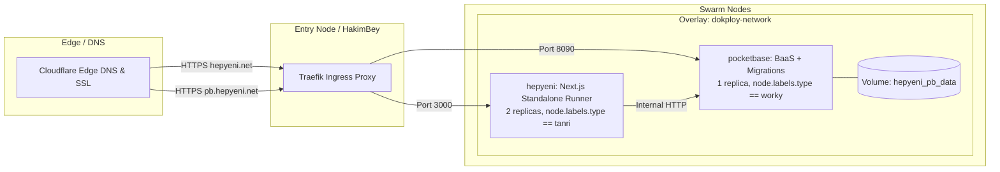

# HepYeni Deployment & Infrastructure Guide

This document details the Docker containerization, Docker Swarm stack, Dokploy integration, CI/CD deployment pipelines, and environment configuration for **HepYeni**.

---

## 1. Infrastructure Overview

HepYeni runs as a containerized stack on **Docker Swarm** managed via **Dokploy**.



### Key Infrastructure Attributes:
- **Application URL**: `https://hepyeni.net`
- **PocketBase Admin UI**: `https://pb.hepyeni.net/_/`
- **Container Registry**: `registry.bogazici.app/budok/hepyeni`
- **Swarm Overlay Network**: `dokploy-network`

---

## 2. Docker Containers

### 2.1 Next.js Application: `Dockerfile`
Located in [`Dockerfile`](file:///home/devhax/projects/fusuycorp/hepyeni/Dockerfile), this multi-stage build creates an optimized Next.js standalone runner:

1. **`base`**: Uses `oven/bun:1-alpine` for minimal image footprint and fast runtime execution.
2. **`deps`**: Runs `bun install --frozen-lockfile`.
3. **`builder`**: Copies dependencies and runs `bun --bun next build`.
   > [!NOTE]
   > Bun 1.3.14 contains an upstream engine exit issue where the process may segfault after successfully writing `.next/standalone`. The build step gates on `bun --bun next build; test -f .next/standalone/server.js` to ensure the artifact exists before proceeding.
4. **`runner`**: Copies the standalone server, creates an unprivileged user (`nextjs:nodejs` UID/GID 1001), and starts the server via `CMD ["bun", "run", "server.js"]` on port 3000.

### 2.2 PocketBase with Baked Migrations: `Dockerfile.pocketbase`
Located in [`Dockerfile.pocketbase`](file:///home/devhax/projects/fusuycorp/hepyeni/Dockerfile.pocketbase):

```dockerfile
FROM ghcr.io/muchobien/pocketbase:0.39.11
COPY pb_migrations /pb_migrations
```

- **Baked Migrations**: Dokploy deploys pre-built images rather than building from git checkouts on nodes. Copying `pb_migrations/` into `/pb_migrations` ensures migrations automatically apply when the container launches.
- **Data Persistence**: Backed by the named Docker volume `hepyeni_pb_data:/pb_data`.
- **Admin Bootstrap**: The base image bootstraps the superuser on initial boot via `PB_ADMIN_EMAIL` and `PB_ADMIN_PASSWORD`.

---

## 3. Dokploy Swarm Stack Configuration

Production services are defined in `services/hepyeni/docker-stack.yml` in the selfhosted deployment repository (this is a summary — that file is authoritative, see its own comments for the reasoning behind each deviation from the generic template, e.g. the `/pb_data` mount path and why Traefik labels are omitted in favor of Dokploy's dynamic domain management):

```yaml
services:
  hepyeni:
    image: ${IMAGE_NAME:-registry.bogazici.app/budok/hepyeni:latest}
    environment:
      - PB_URL=http://pocketbase:8090
      - PB_SUPERUSER_EMAIL=${PB_SUPERUSER_EMAIL}
      - PB_SUPERUSER_PASSWORD=${PB_SUPERUSER_PASSWORD}
      - APP_URL=${APP_URL:-https://hepyeni.net}
      - TMDB_API_KEY=${TMDB_API_KEY}
      - SPOTIFY_CLIENT_ID=${SPOTIFY_CLIENT_ID}
      - SPOTIFY_CLIENT_SECRET=${SPOTIFY_CLIENT_SECRET}
      - FLAG_ENABLE_LLM_EXTRACT=${FLAG_ENABLE_LLM_EXTRACT:-false}
      - LLM_API_URL=${LLM_API_URL:-https://api.openai.com/v1}
      - LLM_API_KEY=${LLM_API_KEY}
      - LLM_MODEL=${LLM_MODEL:-gpt-4o-mini}
    networks:
      - dokploy-network
    healthcheck:
      test: ["CMD-SHELL", "wget --no-verbose --tries=1 --spider http://127.0.0.1:3000/login || exit 1"]
      interval: 20s
      timeout: 5s
      retries: 3
      start_period: 10s
    deploy:
      replicas: 2
      restart_policy:
        condition: on-failure
      placement:
        constraints:
          - node.labels.type == tanri

  pocketbase:
    image: ${PB_IMAGE_NAME:-registry.bogazici.app/budok/hepyeni-pb:latest}
    environment:
      - TZ=Europe/Istanbul
      - PB_ADMIN_EMAIL=${PB_SUPERUSER_EMAIL}
      - PB_ADMIN_PASSWORD=${PB_SUPERUSER_PASSWORD}
    volumes:
      - hepyeni_pb_data:/pb_data
    networks:
      - dokploy-network
    healthcheck:
      test: ["CMD-SHELL", "wget -q --spider http://127.0.0.1:8090/api/health || exit 1"]
      interval: 15s
      timeout: 5s
      retries: 3
      start_period: 15s
    deploy:
      replicas: 1
      restart_policy:
        condition: on-failure
        delay: 5s
        max_attempts: 3
        window: 120s
      placement:
        constraints:
          - node.labels.type == worky
      resources:
        limits:
          cpus: "1.50"
          memory: 512M
        reservations:
          cpus: "0.10"
          memory: 64M

networks:
  dokploy-network:
    external: true

volumes:
  hepyeni_pb_data:
```

---

## 3.1 Optional LLM Runtime Configuration

The optional **Extract from Text** importer sends user-pasted text to the OpenAI-compatible endpoint configured by `LLM_API_URL`, after the user acknowledges the localized disclosure. The request contains the pasted text and extraction prompt, but not the user's account identity or PocketBase records. HepYeni does not use submitted text to train its own models; the selected provider may process or retain requests under its own privacy policy and terms. Users should not paste passwords, access tokens, private messages, or other sensitive information.

Enable the feature only when both `FLAG_ENABLE_LLM_EXTRACT=true` and `LLM_API_KEY` are configured. For processing that stays on infrastructure you control, point `LLM_API_URL` at a local or private OpenAI-compatible service. `LLM_MODEL` defaults to `gpt-4o-mini`.

`LLM_API_KEY` is a runtime secret. Inject it through Docker Compose or the production secret manager. Do not put it in `Dockerfile` `ARG`/`ENV` instructions, build arguments, source files, or image layers. The application reads it only on the server and never exposes it to the browser.

For Docker Compose, use the corresponding entries from `.env.example`:

```yaml
environment:
  - FLAG_ENABLE_LLM_EXTRACT=${FLAG_ENABLE_LLM_EXTRACT:-false}
  - LLM_API_URL=${LLM_API_URL:-https://api.openai.com/v1}
  - LLM_API_KEY=${LLM_API_KEY}
  - LLM_MODEL=${LLM_MODEL:-gpt-4o-mini}
```

---

## 4. CI/CD Deployment Pipeline

A single workflow, [`.github/workflows/deploy.yml`](file:///home/devhax/projects/fusuycorp/hepyeni/.github/workflows/deploy.yml), handles both images and the redeploy, triggered on every push to `main` (excluding `**.md`/`.gitignore`) and via `workflow_dispatch`:

1. **`changes`** — diffs the pushed commit range (`github.event.before...github.sha`) to detect whether `pb_migrations/**` or `Dockerfile.pocketbase` changed. Always `true` on `workflow_dispatch` or when there's no prior commit to diff against (first push / force-push).
2. **`build-app`** — always runs. Builds and pushes `registry.bogazici.app/budok/hepyeni:latest`.
3. **`build-pocketbase`** (`needs: changes`, conditional on `changes.outputs.pocketbase`) — only runs when PocketBase-relevant paths changed. Builds and pushes `registry.bogazici.app/budok/hepyeni-pb:latest`.
4. **`deploy`** (`needs: [build-app, build-pocketbase]`) — waits for both. Since `build-pocketbase` is legitimately skipped on most pushes, this job's `if` explicitly accepts `build-app: success` plus `build-pocketbase` being either `success` or `skipped` (a plain `needs` success check would treat a skip as a block). Sends an authenticated `POST /api/compose.redeploy` to `https://dokploy.bogazici.app` with `x-api-key: ${{ secrets.DOKPLOY_API_KEY }}`; if that fails, retries once with a differently-shaped (tRPC-wrapped) payload against the same endpoint, since Dokploy's API has historically accepted either shape depending on version. This is a fixed two-attempt fallback, **not** a retry loop — there is no delay between attempts.

This replaces a previous two-workflow setup (separate `deploy.yml` / `deploy-pocketbase.yml`) that had no ordering between them: a commit touching only `pb_migrations/**` could redeploy before the new PocketBase image finished pushing, leaving the running `pocketbase` service on stale migrations. The `needs` dependency here makes that ordering explicit and enforced by GitHub Actions rather than incidental to build-time differences.

---

## 5. Local Development Workflow

### 1. Download & Launch PocketBase
```bash
# Download PocketBase (v0.27.2+)
curl -L https://github.com/pocketbase/pocketbase/releases/download/v0.27.2/pocketbase_0.27.2_linux_amd64.zip -o pocketbase.zip
unzip pocketbase.zip pocketbase

# Start PocketBase server (auto-applies pb_migrations/)
./pocketbase serve
```

### 2. Bootstrap Local Superuser
On first startup, create a superuser account:
```bash
./pocketbase superuser upsert admin@local.test password123456
```

### 3. Setup Environment Variables
Create `.env.local`:
```bash
PB_URL=http://127.0.0.1:8090
PB_SUPERUSER_EMAIL=admin@local.test
PB_SUPERUSER_PASSWORD=password123456
APP_URL=http://localhost:3000

# Optional Provider Credentials
TMDB_API_KEY=your_tmdb_bearer_token
SPOTIFY_CLIENT_ID=your_spotify_client_id
SPOTIFY_CLIENT_SECRET=your_spotify_client_secret
```

### 4. Install & Run Dev Server
```bash
bun install
bun run dev
```

---

## 6. Production PocketBase Admin UI Setup

Once PocketBase is deployed at `https://pb.hepyeni.net/_/`:

1. **Google OAuth2 Setup**:
   - Navigate to **Settings $\to$ Auth Providers $\to$ Google**.
   - Enable provider and enter **Client ID** and **Client Secret**.
   - Set Redirect URI in Google Cloud Console to: `https://hepyeni.net/api/auth/oauth2-callback`.
2. **Mail (SMTP) Setup**:
   - Navigate to **Settings $\to$ Mail Settings**.
   - Enable SMTP and enter server host (e.g. `smtp.purelymail.com`), port (`465` SSL), user, and password.
   - Set sender email to: `HepYeni <noreply@hepyeni.net>`.
